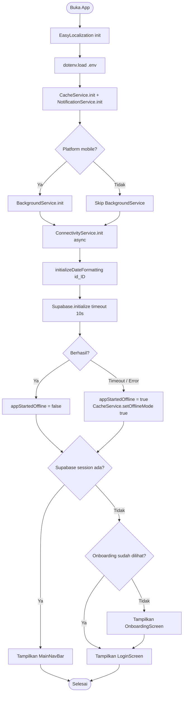
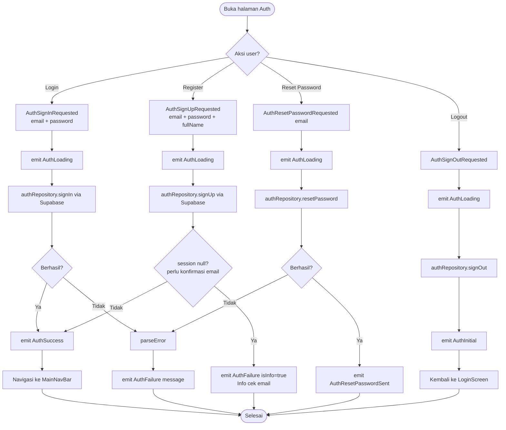
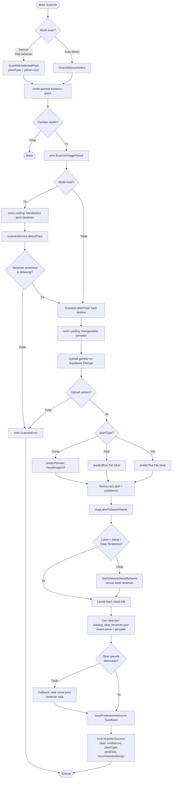
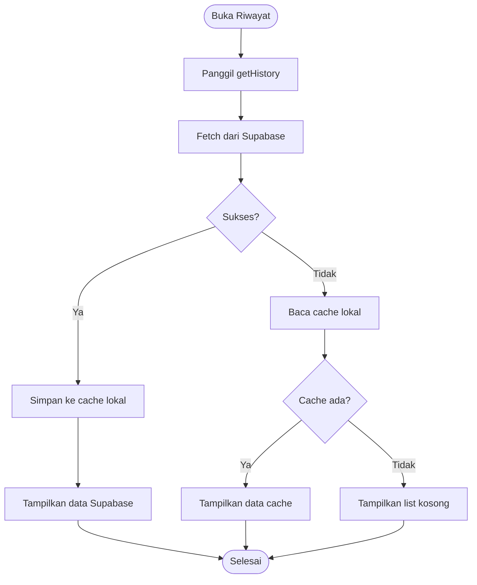
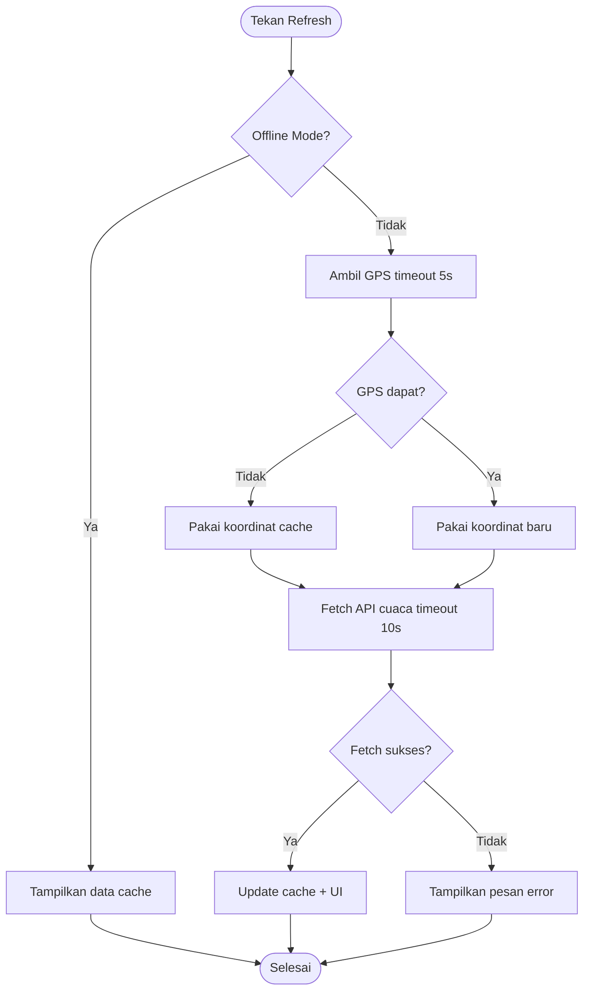
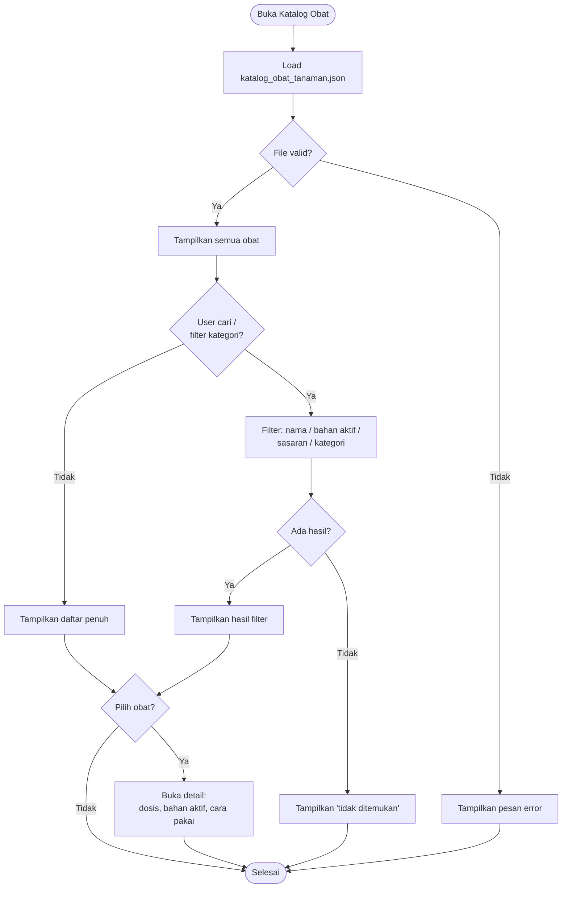
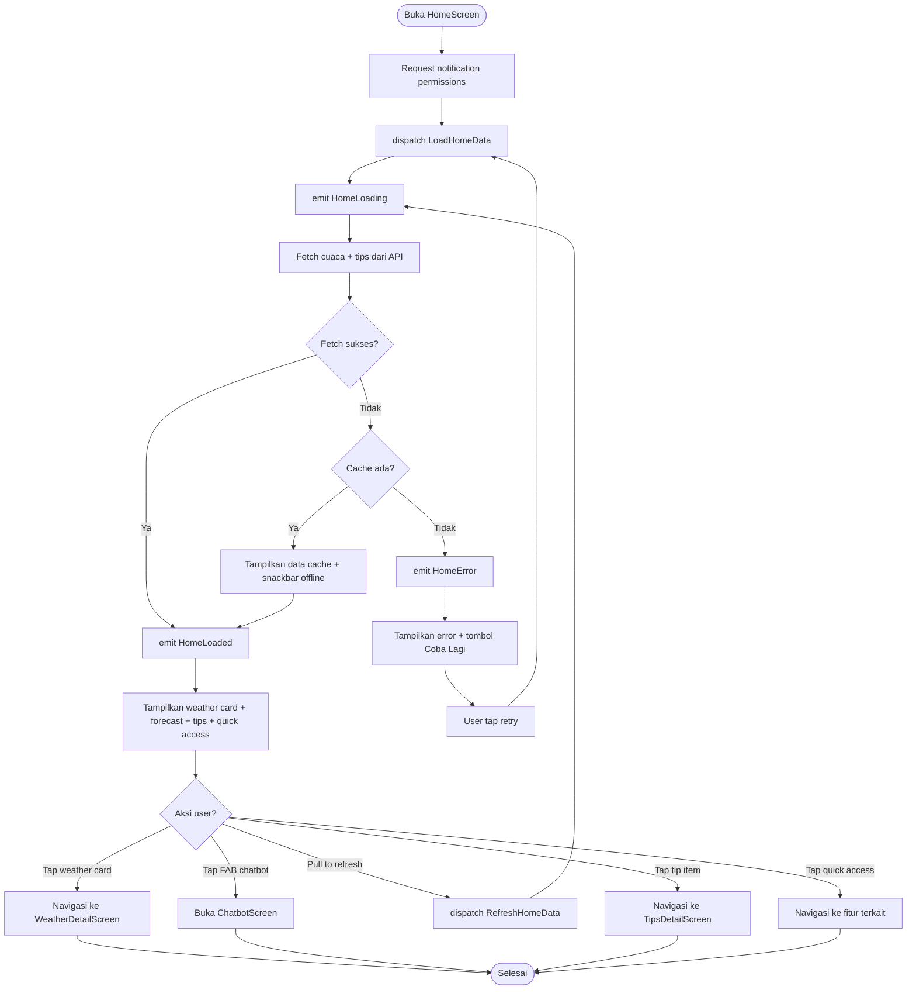
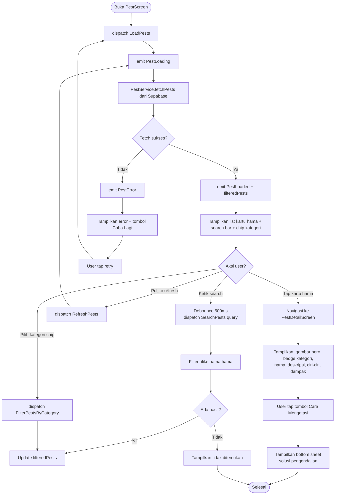
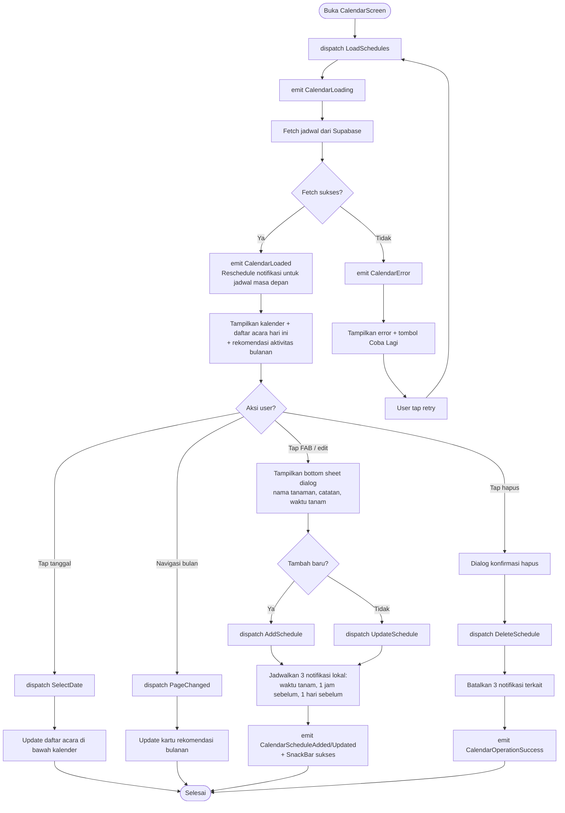
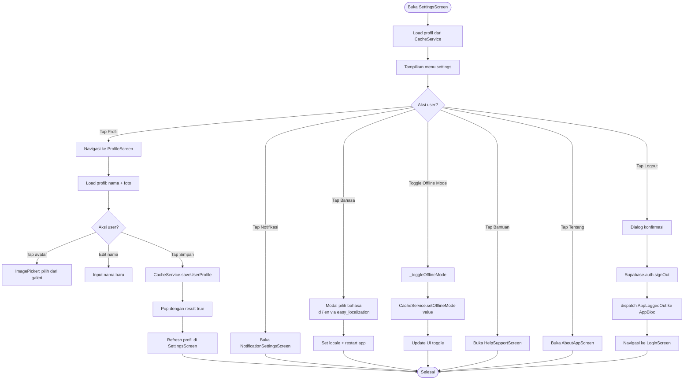

# Activity Diagram - Petani Maju

Dokumentasi **alur aktivitas / logika keputusan** (langkah-langkah & percabangan) untuk fitur utama Petani Maju.

---

## Daftar Isi

- [1. App Startup & Inisialisasi](#1-app-startup--inisialisasi)
- [2. Autentikasi (Login / Register / Reset Password)](#2-autentikasi-login--register--reset-password)
- [3. Scanner Penyakit Tanaman](#3-scanner-penyakit-tanaman)
- [4. Chatbot Asisten Tani](#4-chatbot-asisten-tani)
- [5. Riwayat Prediksi (Offline-First)](#5-riwayat-prediksi-offline-first)
- [6. Refresh Cuaca](#6-refresh-cuaca)
- [7. Pencarian Katalog Obat](#7-pencarian-katalog-obat)
- [8. Home Screen](#8-home-screen)
- [9. Katalog Hama (Pencarian & Filter)](#9-katalog-hama-pencarian--filter)
- [10. Kalender & Jadwal Tanam](#10-kalender--jadwal-tanam)
- [11. Settings & Profil](#11-settings--profil)

---

## 1. App Startup & Inisialisasi

---

## 2. Autentikasi (Login / Register / Reset Password)

---

## 3. Scanner Penyakit Tanaman

---

## 4. Chatbot Asisten Tani

---

## 5. Riwayat Prediksi (Offline-First)

---

## 6. Refresh Cuaca

---

## 7. Pencarian Katalog Obat

---

## 8. Home Screen

---

## 9. Katalog Hama (Pencarian & Filter)

---

## 10. Kalender & Jadwal Tanam

---

## 11. Settings & Profil

---
