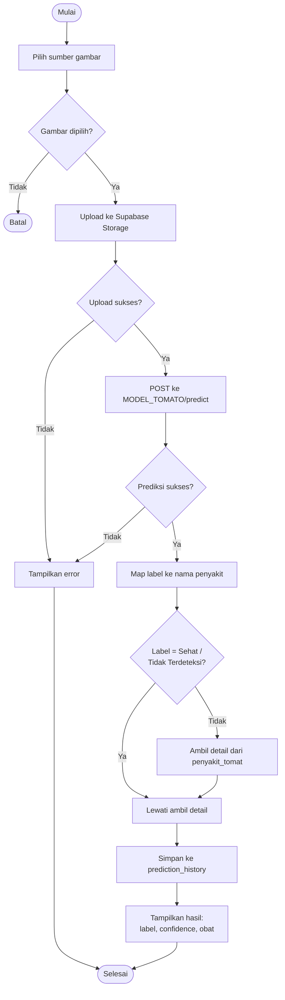
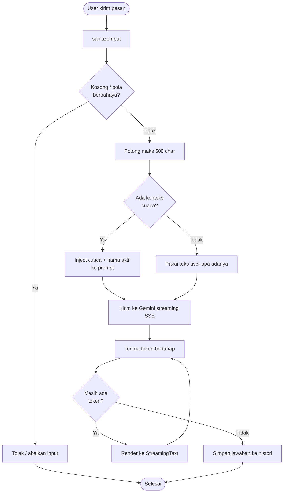

# 🏃 Activity Diagram - Petani Maju

Dokumentasi **alur aktivitas / logika keputusan** (langkah-langkah & percabangan) untuk fitur utama Petani Maju.

---

## 📑 Daftar Isi

- [🏃 Activity Diagram - Petani Maju](#-activity-diagram---petani-maju)
  - [📑 Daftar Isi](#-daftar-isi)
  - [1. Scanner Penyakit Tanaman](#1-scanner-penyakit-tanaman)
  - [2. Chatbot Asisten Tani](#2-chatbot-asisten-tani)
  - [3. Riwayat Prediksi (Offline-First)](#3-riwayat-prediksi-offline-first)
  - [4. Refresh Cuaca](#4-refresh-cuaca)
  - [5. Pencarian Katalog Obat](#5-pencarian-katalog-obat)

---

## 1. Scanner Penyakit Tanaman

---

## 2. Chatbot Asisten Tani

---

## 3. Riwayat Prediksi (Offline-First)

---

## 4. Refresh Cuaca

---

## 5. Pencarian Katalog Obat

---
