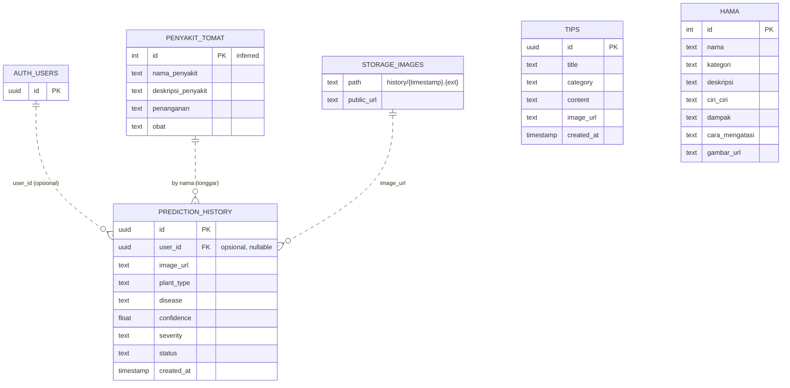

# 🗄️ Entity Relationship Diagram (ERD) - Petani Maju

Dokumentasi struktur database aplikasi **Petani Maju**.

---

## 📑 Daftar Isi

- [Gambaran Umum](#gambaran-umum)
- [Diagram ERD](#diagram-erd)
- [Detail Tabel](#detail-tabel)
- [Relasi](#relasi)
- [Penyimpanan Non-Relasional](#penyimpanan-non-relasional)

---

## 🔭 Gambaran Umum

Backend utama menggunakan **Supabase (PostgreSQL)**. Aplikasi memakai 4 tabel + 1 Storage bucket:

| Entitas | Tipe | Peran |
|---------|------|-------|
| `tips` | Tabel | Artikel/tips pertanian |
| `hama` | Tabel | Katalog hama & penyakit umum |
| `penyakit_tomat` | Tabel | Detail penyakit tomat (target hasil scan AI) |
| `prediction_history` | Tabel | Riwayat hasil deteksi penyakit |
| `images` | Storage Bucket | File foto yang di-scan (folder `history/`) |

---

## 🧬 Diagram ERD

> 💡 Garis putus-putus (`..`) menandakan **relasi logis/longgar** (bukan Foreign Key formal di database).

---

## 📋 Detail Tabel

### `tips`
Artikel tips pertanian (ditampilkan di fitur Tips).

| Kolom | Tipe | Ket. |
|-------|------|------|
| `id` | uuid | Primary Key |
| `title` | text | Judul artikel |
| `category` | text | Kategori (Padi, Jagung, dll) |
| `content` | text | Isi tips |
| `image_url` | text | Link gambar |
| `created_at` | timestamp | Waktu dibuat (di-`order` desc) |

### `hama`
Katalog hama & penyakit umum (fitur Pests). Kolom diturunkan dari pemakaian di UI.

| Kolom | Tipe | Ket. |
|-------|------|------|
| `id` | int (bigint) _(inferred)_ | Primary Key — dipakai `fetchPestById(int id)` |
| `nama` | text | Nama hama — filter `ilike` |
| `kategori` | text _(inferred)_ | Kategori |
| `deskripsi` | text _(inferred)_ | Deskripsi |
| `ciri_ciri` | text _(inferred)_ | Ciri-ciri |
| `dampak` | text _(inferred)_ | Dampak serangan |
| `cara_mengatasi` | text _(inferred)_ | Solusi penanganan |
| `gambar_url` | text _(inferred)_ | Link gambar |

### `penyakit_tomat`
Detail penyakit tomat — target hasil deteksi scanner AI.

| Kolom | Tipe | Ket. |
|-------|------|------|
| `id` | int _(inferred)_ | Primary Key |
| `nama_penyakit` | text | Nama penyakit — kunci pencarian (`ilike`) dari label model |
| `deskripsi_penyakit` | text | Deskripsi |
| `penanganan` | text | Langkah penanganan |
| `obat` | text | Rekomendasi obat |

### `prediction_history`
Riwayat hasil scan. Field di-`insert` langsung dari `ScannerBloc`.

| Kolom | Tipe | Ket. |
|-------|------|------|
| `id` | uuid | Primary Key |
| `user_id` | uuid (nullable) | Pemilik — saat ini selalu di-set `null` |
| `image_url` | text | URL publik foto di Storage |
| `plant_type` | text | Jenis tanaman (mis. `Tomat`) |
| `disease` | text | Nama penyakit terdeteksi (= `penyakit_tomat.nama_penyakit`) |
| `confidence` | float | Keyakinan 0–1 |
| `severity` | text | Keparahan (default `'Pending'`) |
| `status` | text | Status (mis. `'Success'`) |
| `created_at` | timestamp | Waktu prediksi (default DB / di-`order` desc) |

---

## 🔗 Relasi

| Dari | Ke | Tipe | Mekanisme |
|------|----|------|-----------|
| `prediction_history.disease` | `penyakit_tomat.nama_penyakit` | many-to-one (longgar) | **Pencocokan nama**, bukan FK. Label model di-map ke `nama_penyakit` lalu di-`ilike`. |
| `prediction_history.user_id` | `auth.users.id` | many-to-one (opsional) | Supabase Auth. Saat ini selalu `null` (belum ada login). |
| `prediction_history.image_url` | Storage `images/history/` | referensi | URL publik hasil `getPublicUrl()`. |

**Tabel berdiri sendiri (tanpa relasi):** `tips`, `hama`.

---

## 💾 Penyimpanan Non-Relasional

Selain Supabase, aplikasi menyimpan data di luar DB relasional:

### Katalog Obat — Aset Lokal
- **File:** `katalog_obat_tanaman.json` (asset, bukan tabel DB).
- **Field:** `nama`/`nama_obat`, `kategori`, `produsen`, `bahan_aktif`, `dosis`, `deskripsi`, `cara_pakai`, `sasaran[]`, `tanaman[]`, `gambar_url`.
- Dibaca langsung oleh fitur Drugs tanpa koneksi internet.

### Hive (Local Storage Terenkripsi)
Cache lokal AES-256 (lihat `CacheService`). Bukan bagian ERD relasional:

| Box | Isi |
|-----|-----|
| `weatherCache` | Cuaca & forecast |
| `tipsCache` | Tips (& pests) |
| `locationCache` | Lokasi & koordinat |
| `settingsCache` | Profil, notif settings, offline mode, cache history (`saveRawData`) |
| `plantingSchedule` | Jadwal tanam (kalender) |
| `notificationHistory` | Riwayat notifikasi |

---
