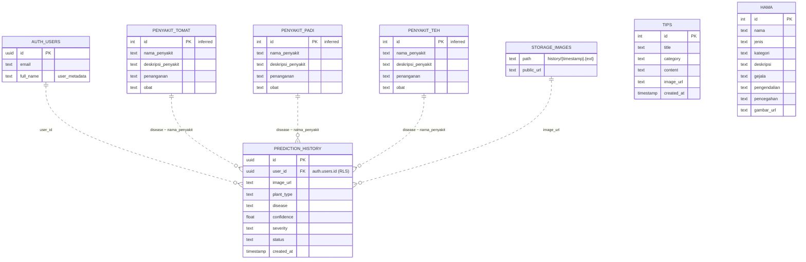

# 🗄️ Entity Relationship Diagram (ERD) - Petani Maju

Dokumentasi struktur database aplikasi **Petani Maju**.

---

## 📑 Daftar Isi

- [Gambaran Umum](#gambaran-umum)
- [Diagram ERD](#diagram-erd)
- [Detail Tabel](#detail-tabel)
- [Relasi](#relasi)
- [Penyimpanan Non-Relasional](#penyimpanan-non-relasional)

---

## 🔭 Gambaran Umum

Backend utama menggunakan **Supabase (PostgreSQL)** dengan **Supabase Auth**. Aplikasi memakai 7 tabel + 1 Storage bucket + autentikasi pengguna:

| Entitas | Tipe | Peran |
|---------|------|-------|
| `tips` | Tabel | Artikel/tips pertanian |
| `hama` | Tabel | Katalog hama & penyakit |
| `penyakit_tomat` | Tabel | Detail penyakit tomat |
| `penyakit_padi` | Tabel | Detail penyakit padi |
| `penyakit_teh` | Tabel | Detail penyakit teh |
| `prediction_history` | Tabel | Riwayat hasil deteksi (dengan RLS) |
| `auth.users` | Auth | Autentikasi pengguna |
| `images` | Storage Bucket | File foto scan (folder `history/`) |

---

## 🧬 Diagram ERD

> 💡 Garis putus-putus (`..`) menandakan **relasi logis/longgar** (bukan Foreign Key formal di database). Relasi `AUTH_USERS` ke `PREDICTION_HISTORY` ditegakkan via RLS, bukan constraint FK.

---

## 📋 Detail Tabel

### `tips`
Artikel tips pertanian (ditampilkan di fitur Tips).

| Kolom | Tipe | Ket. |
|-------|------|------|
| `id` | int | Primary Key |
| `title` | text | Judul artikel |
| `category` | text | Kategori (Padi, Jagung, dll) |
| `content` | text | Isi tips |
| `image_url` | text | Link gambar |
| `created_at` | timestamp | Waktu dibuat (di-`order` desc) |

---

### `hama`
Katalog hama & penyakit umum (fitur Pests).

| Kolom | Tipe | Ket. |
|-------|------|------|
| `id` | int (bigint) | Primary Key — dipakai `fetchPestById(int id)` |
| `nama` | text | Nama hama — filter `ilike` |
| `jenis` | text | Jenis hama (mis. Serangga, Jamur, Bakteri) |
| `kategori` | text | Kategori |
| `deskripsi` | text | Deskripsi umum |
| `gejala` | text | Gejala serangan pada tanaman |
| `pengendalian` | text | Cara pengendalian/penanganan |
| `pencegahan` | text | Langkah pencegahan |
| `gambar_url` | text | Link gambar |

> 📝 Kolom `ciri_ciri`, `dampak`, dan `cara_mengatasi` dari skema lama **digantikan** oleh `jenis`, `gejala`, `pengendalian`, dan `pencegahan`.

---

### `penyakit_tomat` / `penyakit_padi` / `penyakit_teh`
Tiga tabel terpisah dengan skema **identik** — masing-masing untuk tanaman tomat, padi, dan teh. Tabel dipilih secara dinamis berdasarkan nilai `plant_type` pada `prediction_history`.

| Kolom | Tipe | Ket. |
|-------|------|------|
| `id` | int _(inferred)_ | Primary Key |
| `nama_penyakit` | text | Nama penyakit — kunci pencarian (`ilike`) dari label model AI |
| `deskripsi_penyakit` | text | Deskripsi penyakit |
| `penanganan` | text | Langkah penanganan |
| `obat` | text | Rekomendasi obat |

---

### `prediction_history`
Riwayat hasil scan. Field di-`insert` langsung dari `ScannerBloc`. **RLS aktif** — hanya pemilik data yang dapat mengakses barisnya.

| Kolom | Tipe | Ket. |
|-------|------|------|
| `id` | uuid | Primary Key |
| `user_id` | uuid | FK ke `auth.users.id` — wajib diisi (pengguna harus login) |
| `image_url` | text | URL publik foto di Storage |
| `plant_type` | text | Jenis tanaman (`Tomat`, `Padi`, `Teh`) |
| `disease` | text | Nama penyakit terdeteksi — dicocokkan ke tabel penyakit sesuai `plant_type` |
| `confidence` | float | Keyakinan model 0–1 |
| `severity` | text | Keparahan (default `'Pending'`) |
| `status` | text | Status (mis. `'Success'`) |
| `created_at` | timestamp | Waktu prediksi (default DB, di-`order` desc) |

**Row Level Security (RLS):**

| Policy | Operasi | Kondisi |
|--------|---------|---------|
| `select_own_history` | `SELECT` | `auth.uid() = user_id` |
| `insert_own_history` | `INSERT` | `auth.uid() = user_id` |
| `delete_own_history` | `DELETE` | `auth.uid() = user_id` |

---

### `auth.users` (Supabase Auth)
Entitas autentikasi yang dikelola Supabase. Tidak diakses langsung via query SQL — diakses melalui `supabase.auth.*`.

| Kolom | Tipe | Ket. |
|-------|------|------|
| `id` | uuid | Primary Key — direferensikan oleh `prediction_history.user_id` |
| `email` | text | Alamat email pengguna |
| `full_name` | text | Nama lengkap (disimpan di `user_metadata`) |

---

## 🔗 Relasi

| Dari | Ke | Tipe | Mekanisme |
|------|----|------|-----------|
| `prediction_history.disease` | `penyakit_tomat/padi/teh.nama_penyakit` | many-to-one (longgar) | Pencocokan nama `ilike`, tabel dipilih berdasarkan `plant_type` |
| `prediction_history.user_id` | `auth.users.id` | many-to-one | Supabase Auth RLS — user harus login |
| `prediction_history.image_url` | Storage `images/history/` | referensi | URL publik hasil `getPublicUrl()` |

**Tabel berdiri sendiri (tanpa relasi):** `tips`, `hama`, `penyakit_tomat`, `penyakit_padi`, `penyakit_teh`.

---

## 💾 Penyimpanan Non-Relasional

Selain Supabase, aplikasi menyimpan data di luar DB relasional:

### Katalog Obat — Aset Lokal
- **File:** `katalog_obat_tanaman.json` (asset bundled, bukan tabel DB).
- **Field:** `nama`/`nama_obat`, `kategori`, `produsen`, `bahan_aktif`, `dosis`, `deskripsi`, `cara_pakai`, `sasaran[]`, `tanaman[]`, `gambar_url`.
- Dibaca langsung oleh fitur Drugs tanpa koneksi internet.

### Hive (Local Storage Terenkripsi)
Cache lokal AES-256 (lihat `CacheService`). Bukan bagian ERD relasional:

| Box | Isi |
|-----|-----|
| `weatherCache` | Cuaca & forecast |
| `tipsCache` | Tips (& pests) |
| `locationCache` | Lokasi & koordinat |
| `settingsCache` | Profil, notif settings, offline mode, cache history (`saveRawData`) |
| `notificationHistory` | Riwayat notifikasi |
| `plantingSchedule` | Jadwal tanam (nama_tanaman, tanggal_tanam, catatan) — dikelola `PlantingScheduleService` |

---
