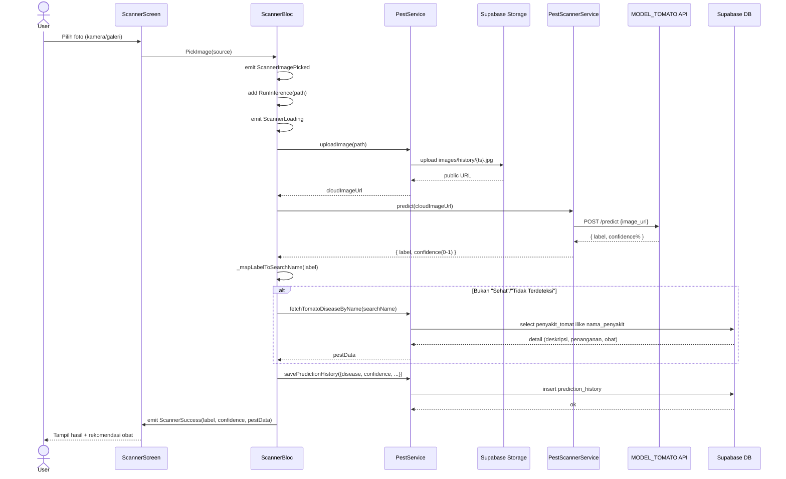
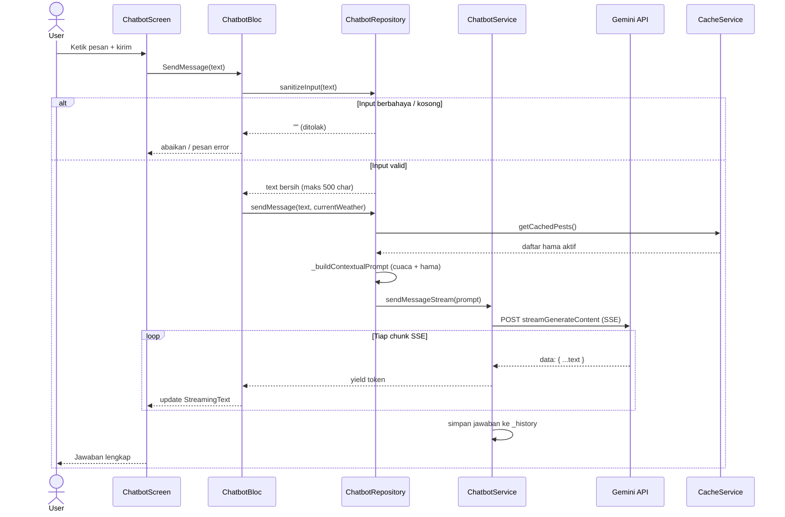
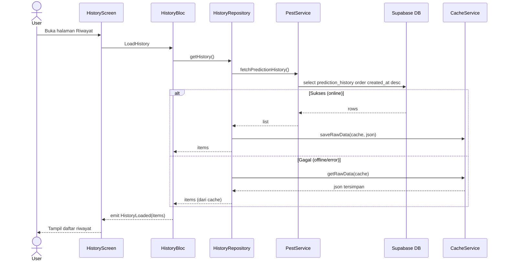
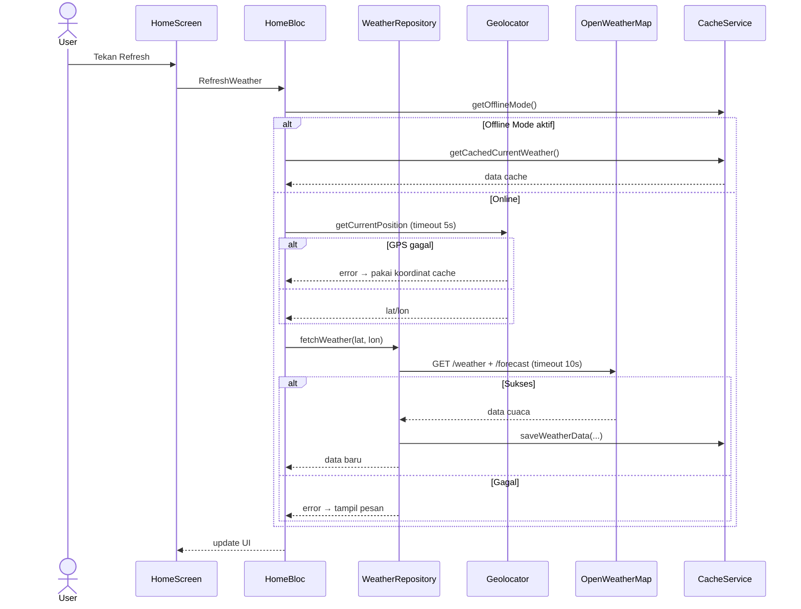
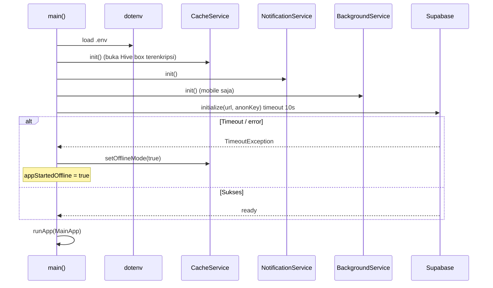

# 🔄 Sequence Diagram - Petani Maju

Dokumentasi **interaksi antar komponen** (urutan pesan/waktu) untuk alur-alur utama aplikasi Petani Maju.

---

## 📑 Daftar Isi

- [🔄 Sequence Diagram - Petani Maju](#-sequence-diagram---petani-maju)
  - [📑 Daftar Isi](#-daftar-isi)
  - [1. Scanner Penyakit Tanaman (AI)](#1-scanner-penyakit-tanaman-ai)
  - [2. Chatbot Asisten Tani (Gemini)](#2-chatbot-asisten-tani-gemini)
  - [3. Riwayat Prediksi (Offline-First)](#3-riwayat-prediksi-offline-first)
  - [4. Refresh Cuaca](#4-refresh-cuaca)
  - [5. Startup Aplikasi](#5-startup-aplikasi)

---

## 1. Scanner Penyakit Tanaman (AI)

Alur dari user memilih foto sampai hasil tersimpan ke riwayat.

> ⚠️ Jika upload/predict gagal → `ScannerError`. Penyimpanan history dibungkus try-catch (gagal simpan tidak menggagalkan tampilan hasil).

---

## 2. Chatbot Asisten Tani (Gemini)

Alur pengiriman pesan dengan respons **streaming** dan konteks cuaca.

---

## 3. Riwayat Prediksi (Offline-First)

Alur memuat riwayat: Supabase dulu, fallback cache.

---

## 4. Refresh Cuaca

---

## 5. Startup Aplikasi

---
