# Sequence Diagram — Petani Maju

Dokumentasi **interaksi antar komponen** (urutan pesan/waktu) untuk semua alur utama aplikasi Petani Maju.

---

## Daftar Isi

1. [App Initialization & Lifecycle](#1-app-initialization--lifecycle)
2. [Login Flow](#2-login-flow)
3. [Register Flow](#3-register-flow)
4. [Password Reset Flow](#4-password-reset-flow)
5. [Main Navigation (NavBar)](#5-main-navigation-navbar)
6. [Home Screen & Weather Load](#6-home-screen--weather-load)
7. [Disease Scanner Flow](#7-disease-scanner-flow)
8. [Chatbot Flow](#8-chatbot-flow)
9. [Pests Feature](#9-pests-feature)
10. [Drugs Feature](#10-drugs-feature)
11. [Tips Feature](#11-tips-feature)
12. [History Feature](#12-history-feature)
13. [Calendar Feature](#13-calendar-feature)
14. [Settings & Profile](#14-settings--profile)

---

## 1. App Initialization & Lifecycle

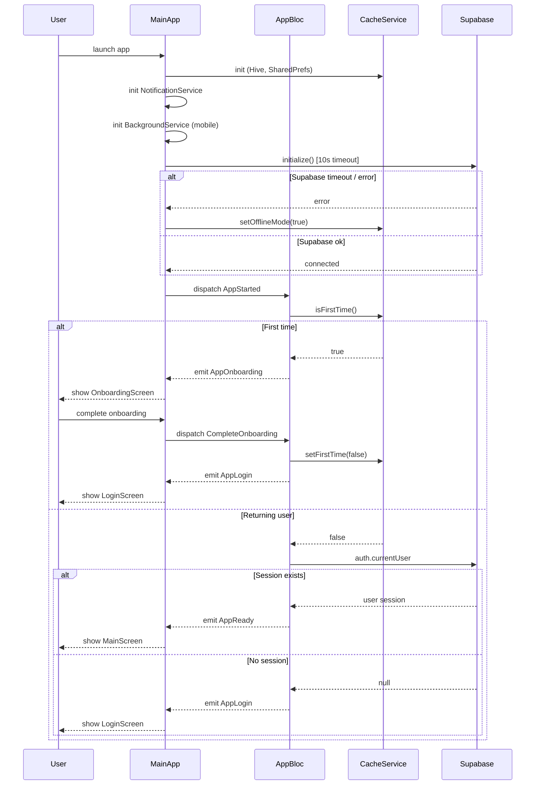
```mermaid
sequenceDiagram
    participant U as User
    participant App as MainApp
    participant AB as AppBloc
    participant CS as CacheService
    participant SB as Supabase

    U->>App: launch app
    App->>CS: init (Hive, SharedPrefs)
    App->>App: init NotificationService
    App->>App: init BackgroundService (mobile)
    App->>SB: initialize() [10s timeout]
    alt Supabase timeout / error
        SB-->>App: error
        App->>CS: setOfflineMode(true)
    else Supabase ok
        SB-->>App: connected
    end
    App->>AB: dispatch AppStarted
    AB->>CS: isFirstTime()
    alt First time
        CS-->>AB: true
        AB-->>App: emit AppOnboarding
        App-->>U: show OnboardingScreen
        U->>App: complete onboarding
        App->>AB: dispatch CompleteOnboarding
        AB->>CS: setFirstTime(false)
        AB-->>App: emit AppLogin
        App-->>U: show LoginScreen
    else Returning user
        CS-->>AB: false
        AB->>SB: auth.currentUser
        alt Session exists
            SB-->>AB: user session
            AB-->>App: emit AppReady
            App-->>U: show MainScreen
        else No session
            SB-->>AB: null
            AB-->>App: emit AppLogin
            App-->>U: show LoginScreen
        end
    end
```

---

## 2. Login Flow

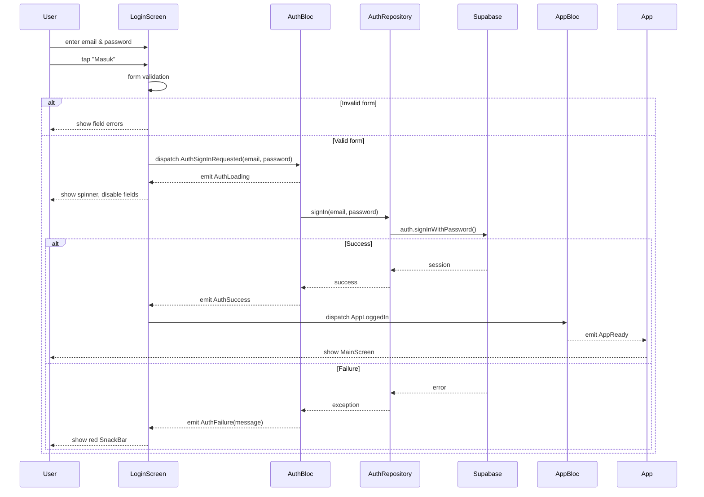
```mermaid
sequenceDiagram
    participant U as User
    participant LS as LoginScreen
    participant AuthB as AuthBloc
    participant AR as AuthRepository
    participant SB as Supabase
    participant AB as AppBloc

    U->>LS: enter email & password
    U->>LS: tap "Masuk"
    LS->>LS: form validation
    alt Invalid form
        LS-->>U: show field errors
    else Valid form
        LS->>AuthB: dispatch AuthSignInRequested(email, password)
        AuthB-->>LS: emit AuthLoading
        LS-->>U: show spinner, disable fields
        AuthB->>AR: signIn(email, password)
        AR->>SB: auth.signInWithPassword()
        alt Success
            SB-->>AR: session
            AR-->>AuthB: success
            AuthB-->>LS: emit AuthSuccess
            LS->>AB: dispatch AppLoggedIn
            AB-->>App: emit AppReady
            App-->>U: show MainScreen
        else Failure
            SB-->>AR: error
            AR-->>AuthB: exception
            AuthB-->>LS: emit AuthFailure(message)
            LS-->>U: show red SnackBar
        end
    end
```

---

## 3. Register Flow

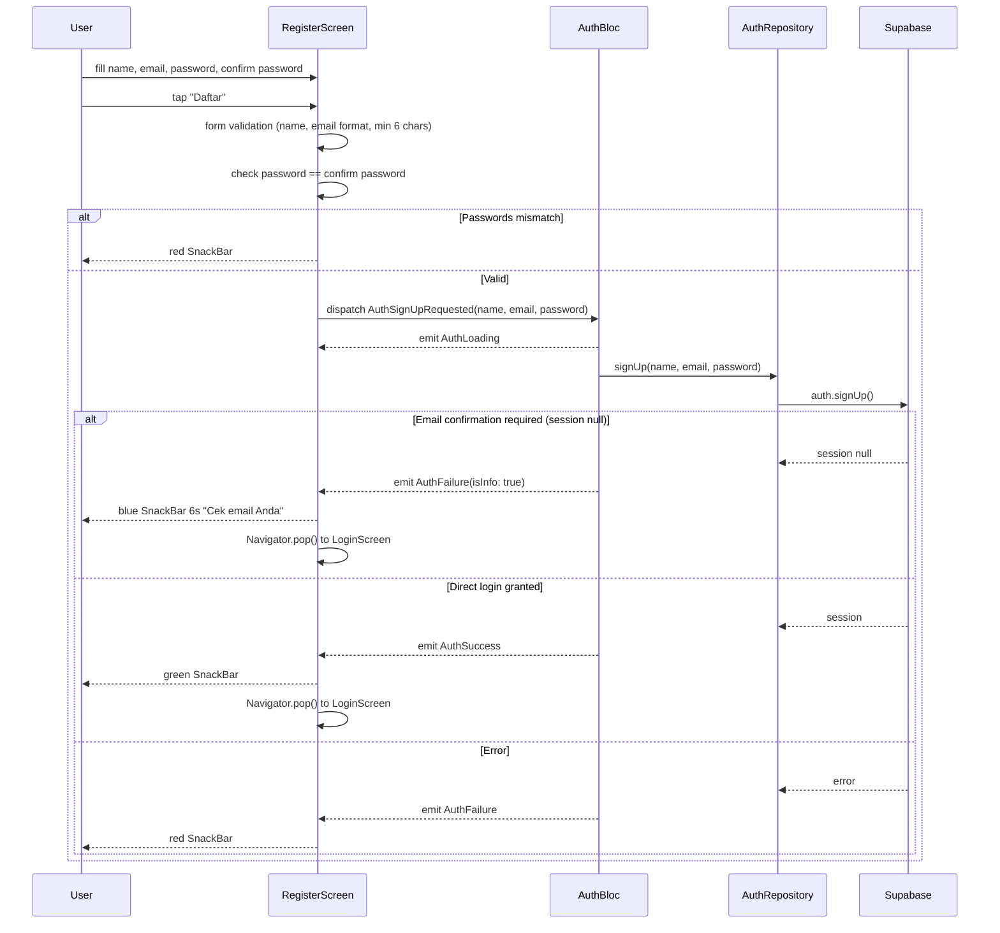
```mermaid
sequenceDiagram
    participant U as User
    participant RS as RegisterScreen
    participant AuthB as AuthBloc
    participant AR as AuthRepository
    participant SB as Supabase

    U->>RS: fill name, email, password, confirm password
    U->>RS: tap "Daftar"
    RS->>RS: form validation (name, email format, min 6 chars)
    RS->>RS: check password == confirm password
    alt Passwords mismatch
        RS-->>U: red SnackBar
    else Valid
        RS->>AuthB: dispatch AuthSignUpRequested(name, email, password)
        AuthB-->>RS: emit AuthLoading
        AuthB->>AR: signUp(name, email, password)
        AR->>SB: auth.signUp()
        alt Email confirmation required (session null)
            SB-->>AR: session null
            AuthB-->>RS: emit AuthFailure(isInfo: true)
            RS-->>U: blue SnackBar 6s "Cek email Anda"
            RS->>RS: Navigator.pop() to LoginScreen
        else Direct login granted
            SB-->>AR: session
            AuthB-->>RS: emit AuthSuccess
            RS-->>U: green SnackBar
            RS->>RS: Navigator.pop() to LoginScreen
        else Error
            SB-->>AR: error
            AuthB-->>RS: emit AuthFailure
            RS-->>U: red SnackBar
        end
    end
```

---

## 4. Password Reset Flow

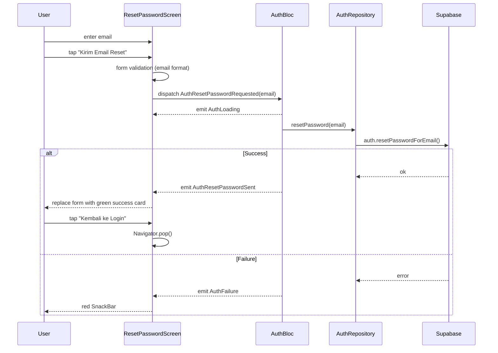
```mermaid
sequenceDiagram
    participant U as User
    participant RPS as ResetPasswordScreen
    participant AuthB as AuthBloc
    participant AR as AuthRepository
    participant SB as Supabase

    U->>RPS: enter email
    U->>RPS: tap "Kirim Email Reset"
    RPS->>RPS: form validation (email format)
    RPS->>AuthB: dispatch AuthResetPasswordRequested(email)
    AuthB-->>RPS: emit AuthLoading
    AuthB->>AR: resetPassword(email)
    AR->>SB: auth.resetPasswordForEmail()
    alt Success
        SB-->>AR: ok
        AuthB-->>RPS: emit AuthResetPasswordSent
        RPS-->>U: replace form with green success card
        U->>RPS: tap "Kembali ke Login"
        RPS->>RPS: Navigator.pop()
    else Failure
        SB-->>AR: error
        AuthB-->>RPS: emit AuthFailure
        RPS-->>U: red SnackBar
    end
```

---

## 5. Main Navigation (NavBar)

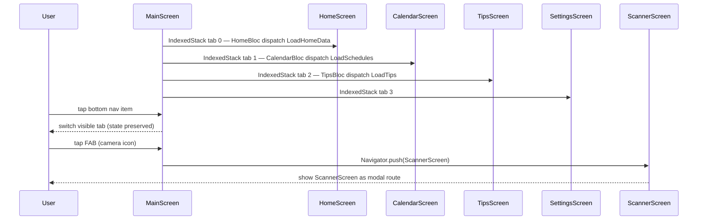
```mermaid
sequenceDiagram
    participant U as User
    participant MS as MainScreen
    participant HS as HomeScreen
    participant KS as CalendarScreen
    participant TS as TipsScreen
    participant SS as SettingsScreen
    participant SC as ScannerScreen

    MS->>HS: IndexedStack tab 0 — HomeBloc dispatch LoadHomeData
    MS->>KS: IndexedStack tab 1 — CalendarBloc dispatch LoadSchedules
    MS->>TS: IndexedStack tab 2 — TipsBloc dispatch LoadTips
    MS->>SS: IndexedStack tab 3

    U->>MS: tap bottom nav item
    MS-->>U: switch visible tab (state preserved)

    U->>MS: tap FAB (camera icon)
    MS->>SC: Navigator.push(ScannerScreen)
    SC-->>U: show ScannerScreen as modal route
```

---

## 6. Home Screen & Weather Load

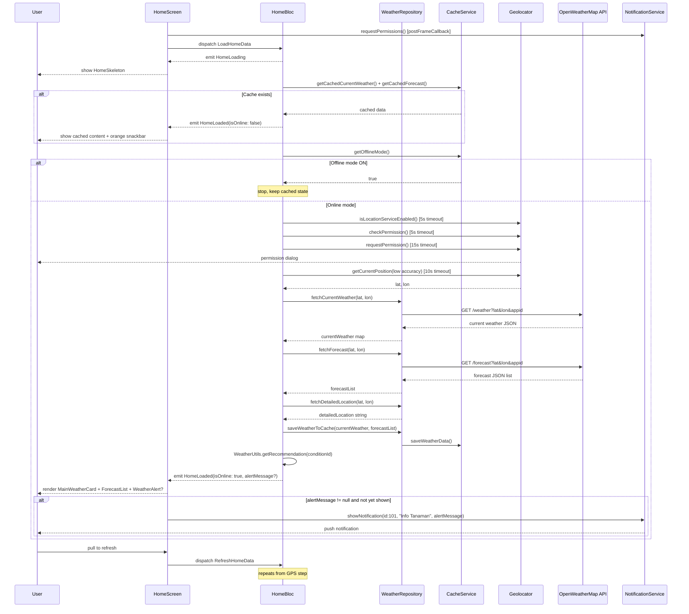
```mermaid
sequenceDiagram
    participant U as User
    participant HS as HomeScreen
    participant HB as HomeBloc
    participant WR as WeatherRepository
    participant CS as CacheService
    participant GPS as Geolocator
    participant OWM as OpenWeatherMap API
    participant NS as NotificationService

    HS->>NS: requestPermissions() [postFrameCallback]
    HS->>HB: dispatch LoadHomeData
    HB-->>HS: emit HomeLoading
    HS-->>U: show HomeSkeleton

    HB->>CS: getCachedCurrentWeather() + getCachedForecast()
    alt Cache exists
        CS-->>HB: cached data
        HB-->>HS: emit HomeLoaded(isOnline: false)
        HS-->>U: show cached content + orange snackbar
    end

    HB->>CS: getOfflineMode()
    alt Offline mode ON
        CS-->>HB: true
        Note over HB: stop, keep cached state
    else Online mode
        HB->>GPS: isLocationServiceEnabled() [5s timeout]
        HB->>GPS: checkPermission() [5s timeout]
        HB->>GPS: requestPermission() [15s timeout]
        GPS-->>U: permission dialog
        HB->>GPS: getCurrentPosition(low accuracy) [10s timeout]
        GPS-->>HB: lat, lon

        HB->>WR: fetchCurrentWeather(lat, lon)
        WR->>OWM: GET /weather?lat&lon&appid
        OWM-->>WR: current weather JSON
        WR-->>HB: currentWeather map

        HB->>WR: fetchForecast(lat, lon)
        WR->>OWM: GET /forecast?lat&lon&appid
        OWM-->>WR: forecast JSON list
        WR-->>HB: forecastList

        HB->>WR: fetchDetailedLocation(lat, lon)
        WR-->>HB: detailedLocation string

        HB->>WR: saveWeatherToCache(currentWeather, forecastList)
        WR->>CS: saveWeatherData()

        HB->>HB: WeatherUtils.getRecommendation(conditionId)
        HB-->>HS: emit HomeLoaded(isOnline: true, alertMessage?)
        HS-->>U: render MainWeatherCard + ForecastList + WeatherAlert?

        alt alertMessage != null and not yet shown
            HS->>NS: showNotification(id:101, "Info Tanaman", alertMessage)
            NS-->>U: push notification
        end
    end

    U->>HS: pull to refresh
    HS->>HB: dispatch RefreshHomeData
    Note over HB: repeats from GPS step
```

---

## 7. Disease Scanner Flow

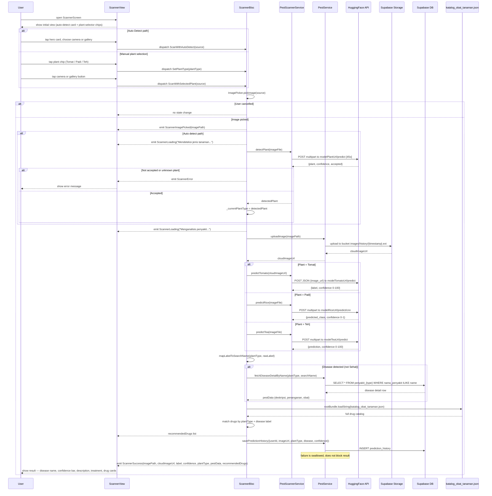
```mermaid
sequenceDiagram
    participant U as User
    participant SV as ScannerView
    participant SB as ScannerBloc
    participant PSvc as PestScannerService
    participant PService as PestService
    participant HF as HuggingFace API
    participant SupaS as Supabase Storage
    participant SupaDB as Supabase DB
    participant Asset as katalog_obat_tanaman.json

    U->>SV: open ScannerScreen
    SV-->>U: show initial view (auto-detect card + plant selector chips)

    alt Auto Detect path
        U->>SV: tap hero card, choose camera or gallery
        SV->>SB: dispatch ScanWithAutoDetect(source)
    else Manual plant selection
        U->>SV: tap plant chip (Tomat / Padi / Teh)
        SV->>SB: dispatch SetPlantType(plantType)
        U->>SV: tap camera or gallery button
        SV->>SB: dispatch ScanWithSelectedPlant(source)
    end

    SB->>SB: ImagePicker.pickImage(source)
    alt User cancelled
        SB-->>SV: no state change
    else Image picked
        SB-->>SV: emit ScannerImagePicked(imagePath)

        alt Auto detect path
            SB-->>SV: emit ScannerLoading("Mendeteksi jenis tanaman...")
            SB->>PSvc: detectPlant(imageFile)
            PSvc->>HF: POST multipart to modelPlantUrl/predict [45s]
            HF-->>PSvc: {plant, confidence, accepted}
            alt Not accepted or unknown plant
                SB-->>SV: emit ScannerError
                SV-->>U: show error message
            else Accepted
                PSvc-->>SB: detectedPlant
                SB->>SB: _currentPlantType = detectedPlant
            end
        end

        SB-->>SV: emit ScannerLoading("Menganalisis penyakit...")
        SB->>PService: uploadImage(imagePath)
        PService->>SupaS: upload to bucket images/history/{timestamp}.ext
        SupaS-->>PService: cloudImageUrl
        PService-->>SB: cloudImageUrl

        alt Plant = Tomat
            SB->>PSvc: predictTomato(cloudImageUrl)
            PSvc->>HF: POST JSON {image_url} to modelTomatoUrl/predict
            HF-->>PSvc: {label, confidence 0-100}
        else Plant = Padi
            SB->>PSvc: predictRice(imageFile)
            PSvc->>HF: POST multipart to modelRiceUrl/predict/cnn
            HF-->>PSvc: {predicted_class, confidence 0-1}
        else Plant = Teh
            SB->>PSvc: predictTea(imageFile)
            PSvc->>HF: POST multipart to modelTeaUrl/predict
            HF-->>PSvc: {prediction, confidence 0-100}
        end

        SB->>SB: mapLabelToSearchName(plantType, rawLabel)

        alt Disease detected (not Sehat)
            SB->>PService: fetchDiseaseDetailByName(plantType, searchName)
            PService->>SupaDB: SELECT * FROM penyakit_{type} WHERE nama_penyakit ILIKE name
            SupaDB-->>PService: disease detail row
            PService-->>SB: pestData (deskripsi, penanganan, obat)
        end

        SB->>Asset: rootBundle.loadString(katalog_obat_tanaman.json)
        Asset-->>SB: full drug catalog
        SB->>SB: match drugs by plantType + disease label
        SB-->>SV: recommendedDrugs list

        SB->>PService: savePredictionHistory({userId, imageUrl, plantType, disease, confidence})
        PService->>SupaDB: INSERT prediction_history
        Note over PService: failure is swallowed, does not block result

        SB-->>SV: emit ScannerSuccess(imagePath, cloudImageUrl, label, confidence, plantType, pestData, recommendedDrugs)
        SV-->>U: show result — disease name, confidence bar, description, treatment, drug cards
    end
```

---

## 8. Chatbot Flow

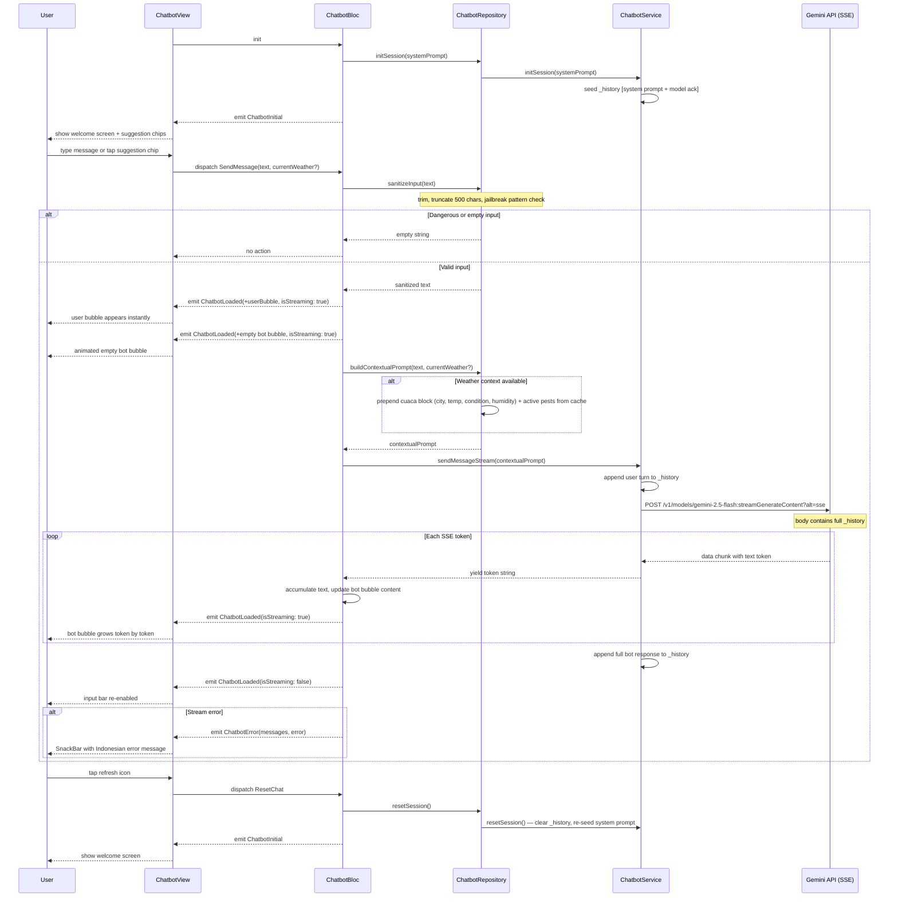
```mermaid
sequenceDiagram
    participant U as User
    participant CV as ChatbotView
    participant CB as ChatbotBloc
    participant CR as ChatbotRepository
    participant CSvc as ChatbotService
    participant Gemini as Gemini API (SSE)

    CV->>CB: init
    CB->>CR: initSession(systemPrompt)
    CR->>CSvc: initSession(systemPrompt)
    CSvc->>CSvc: seed _history [system prompt + model ack]
    CB-->>CV: emit ChatbotInitial
    CV-->>U: show welcome screen + suggestion chips

    U->>CV: type message or tap suggestion chip
    CV->>CB: dispatch SendMessage(text, currentWeather?)

    CB->>CR: sanitizeInput(text)
    Note over CR: trim, truncate 500 chars, jailbreak pattern check
    alt Dangerous or empty input
        CR-->>CB: empty string
        CB-->>CV: no action
    else Valid input
        CR-->>CB: sanitized text
        CB-->>CV: emit ChatbotLoaded(+userBubble, isStreaming: true)
        CV-->>U: user bubble appears instantly
        CB-->>CV: emit ChatbotLoaded(+empty bot bubble, isStreaming: true)
        CV-->>U: animated empty bot bubble

        CB->>CR: buildContextualPrompt(text, currentWeather?)
        alt Weather context available
            CR->>CR: prepend cuaca block (city, temp, condition, humidity) + active pests from cache
        end
        CR-->>CB: contextualPrompt

        CB->>CSvc: sendMessageStream(contextualPrompt)
        CSvc->>CSvc: append user turn to _history
        CSvc->>Gemini: POST /v1/models/gemini-2.5-flash:streamGenerateContent?alt=sse
        Note over Gemini: body contains full _history

        loop Each SSE token
            Gemini-->>CSvc: data chunk with text token
            CSvc-->>CB: yield token string
            CB->>CB: accumulate text, update bot bubble content
            CB-->>CV: emit ChatbotLoaded(isStreaming: true)
            CV-->>U: bot bubble grows token by token
        end

        CSvc->>CSvc: append full bot response to _history
        CB-->>CV: emit ChatbotLoaded(isStreaming: false)
        CV-->>U: input bar re-enabled

        alt Stream error
            CB-->>CV: emit ChatbotError(messages, error)
            CV-->>U: SnackBar with Indonesian error message
        end
    end

    U->>CV: tap refresh icon
    CV->>CB: dispatch ResetChat
    CB->>CR: resetSession()
    CR->>CSvc: resetSession() — clear _history, re-seed system prompt
    CB-->>CV: emit ChatbotInitial
    CV-->>U: show welcome screen
```

---

## 9. Pests Feature

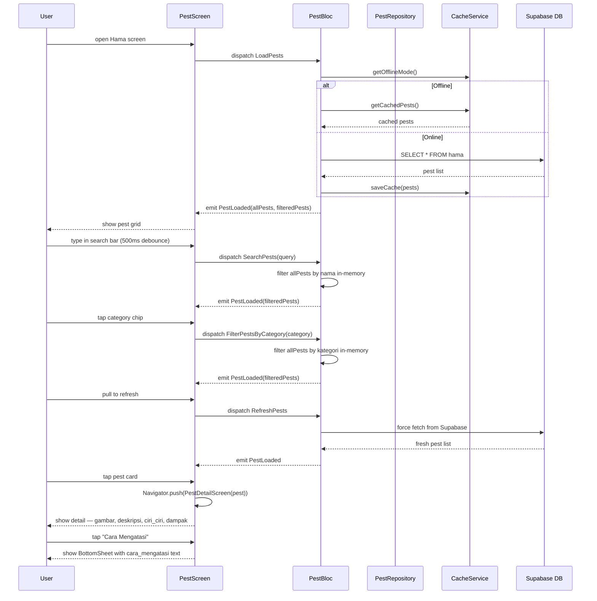
```mermaid
sequenceDiagram
    participant U as User
    participant PS as PestScreen
    participant PB as PestBloc
    participant PR as PestRepository
    participant CS as CacheService
    participant SupaDB as Supabase DB

    U->>PS: open Hama screen
    PS->>PB: dispatch LoadPests
    PB->>CS: getOfflineMode()
    alt Offline
        PB->>CS: getCachedPests()
        CS-->>PB: cached pests
    else Online
        PB->>SupaDB: SELECT * FROM hama
        SupaDB-->>PB: pest list
        PB->>CS: saveCache(pests)
    end
    PB-->>PS: emit PestLoaded(allPests, filteredPests)
    PS-->>U: show pest grid

    U->>PS: type in search bar (500ms debounce)
    PS->>PB: dispatch SearchPests(query)
    PB->>PB: filter allPests by nama in-memory
    PB-->>PS: emit PestLoaded(filteredPests)

    U->>PS: tap category chip
    PS->>PB: dispatch FilterPestsByCategory(category)
    PB->>PB: filter allPests by kategori in-memory
    PB-->>PS: emit PestLoaded(filteredPests)

    U->>PS: pull to refresh
    PS->>PB: dispatch RefreshPests
    PB->>SupaDB: force fetch from Supabase
    SupaDB-->>PB: fresh pest list
    PB-->>PS: emit PestLoaded

    U->>PS: tap pest card
    PS->>PS: Navigator.push(PestDetailScreen(pest))
    PS-->>U: show detail — gambar, deskripsi, ciri_ciri, dampak
    U->>PS: tap "Cara Mengatasi"
    PS-->>U: show BottomSheet with cara_mengatasi text
```

---

## 10. Drugs Feature

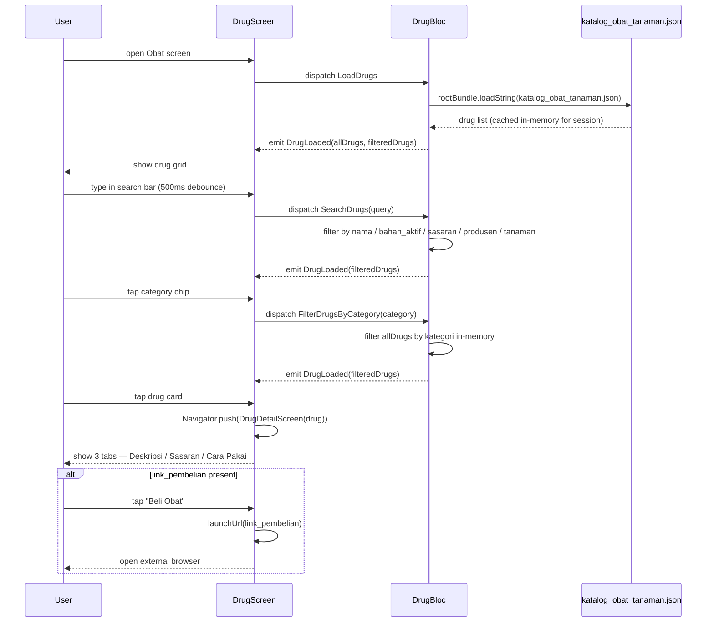
```mermaid
sequenceDiagram
    participant U as User
    participant DS as DrugScreen
    participant DB as DrugBloc
    participant Asset as katalog_obat_tanaman.json

    U->>DS: open Obat screen
    DS->>DB: dispatch LoadDrugs
    DB->>Asset: rootBundle.loadString(katalog_obat_tanaman.json)
    Asset-->>DB: drug list (cached in-memory for session)
    DB-->>DS: emit DrugLoaded(allDrugs, filteredDrugs)
    DS-->>U: show drug grid

    U->>DS: type in search bar (500ms debounce)
    DS->>DB: dispatch SearchDrugs(query)
    DB->>DB: filter by nama / bahan_aktif / sasaran / produsen / tanaman
    DB-->>DS: emit DrugLoaded(filteredDrugs)

    U->>DS: tap category chip
    DS->>DB: dispatch FilterDrugsByCategory(category)
    DB->>DB: filter allDrugs by kategori in-memory
    DB-->>DS: emit DrugLoaded(filteredDrugs)

    U->>DS: tap drug card
    DS->>DS: Navigator.push(DrugDetailScreen(drug))
    DS-->>U: show 3 tabs — Deskripsi / Sasaran / Cara Pakai

    alt link_pembelian present
        U->>DS: tap "Beli Obat"
        DS->>DS: launchUrl(link_pembelian)
        DS-->>U: open external browser
    end
```

---

## 11. Tips Feature

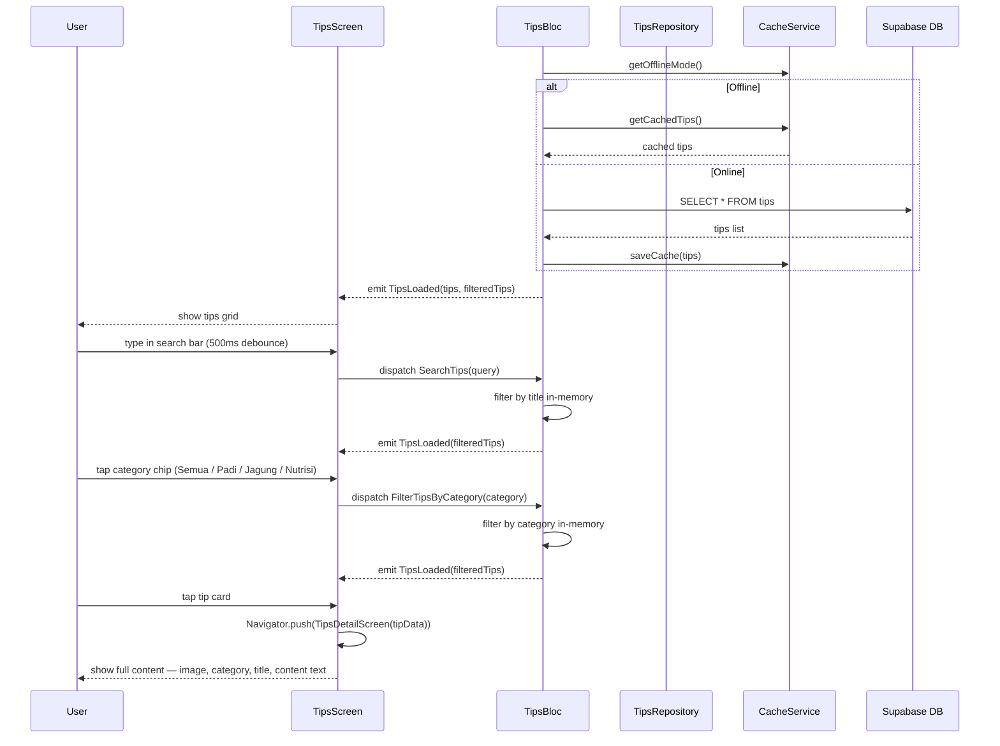
```mermaid
sequenceDiagram
    participant U as User
    participant TS as TipsScreen
    participant TB as TipsBloc
    participant TR as TipsRepository
    participant CS as CacheService
    participant SupaDB as Supabase DB

    TB->>CS: getOfflineMode()
    alt Offline
        TB->>CS: getCachedTips()
        CS-->>TB: cached tips
    else Online
        TB->>SupaDB: SELECT * FROM tips
        SupaDB-->>TB: tips list
        TB->>CS: saveCache(tips)
    end
    TB-->>TS: emit TipsLoaded(tips, filteredTips)
    TS-->>U: show tips grid

    U->>TS: type in search bar (500ms debounce)
    TS->>TB: dispatch SearchTips(query)
    TB->>TB: filter by title in-memory
    TB-->>TS: emit TipsLoaded(filteredTips)

    U->>TS: tap category chip (Semua / Padi / Jagung / Nutrisi)
    TS->>TB: dispatch FilterTipsByCategory(category)
    TB->>TB: filter by category in-memory
    TB-->>TS: emit TipsLoaded(filteredTips)

    U->>TS: tap tip card
    TS->>TS: Navigator.push(TipsDetailScreen(tipData))
    TS-->>U: show full content — image, category, title, content text
```

---

## 12. History Feature

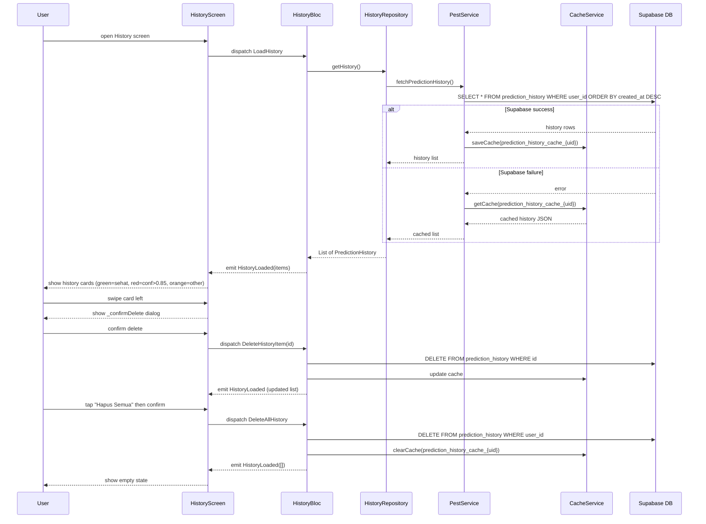
```mermaid
sequenceDiagram
    participant U as User
    participant HistS as HistoryScreen
    participant HistB as HistoryBloc
    participant HistR as HistoryRepository
    participant PService as PestService
    participant CS as CacheService
    participant SupaDB as Supabase DB

    U->>HistS: open History screen
    HistS->>HistB: dispatch LoadHistory
    HistB->>HistR: getHistory()
    HistR->>PService: fetchPredictionHistory()
    PService->>SupaDB: SELECT * FROM prediction_history WHERE user_id ORDER BY created_at DESC

    alt Supabase success
        SupaDB-->>PService: history rows
        PService->>CS: saveCache(prediction_history_cache_{uid})
        PService-->>HistR: history list
    else Supabase failure
        SupaDB-->>PService: error
        PService->>CS: getCache(prediction_history_cache_{uid})
        CS-->>PService: cached history JSON
        PService-->>HistR: cached list
    end

    HistR-->>HistB: List of PredictionHistory
    HistB-->>HistS: emit HistoryLoaded(items)
    HistS-->>U: show history cards (green=sehat, red=conf>0.85, orange=other)

    U->>HistS: swipe card left
    HistS-->>U: show _confirmDelete dialog
    U->>HistS: confirm delete
    HistS->>HistB: dispatch DeleteHistoryItem(id)
    HistB->>SupaDB: DELETE FROM prediction_history WHERE id
    HistB->>CS: update cache
    HistB-->>HistS: emit HistoryLoaded (updated list)

    U->>HistS: tap "Hapus Semua" then confirm
    HistS->>HistB: dispatch DeleteAllHistory
    HistB->>SupaDB: DELETE FROM prediction_history WHERE user_id
    HistB->>CS: clearCache(prediction_history_cache_{uid})
    HistB-->>HistS: emit HistoryLoaded([])
    HistS-->>U: show empty state
```

---

## 13. Calendar Feature

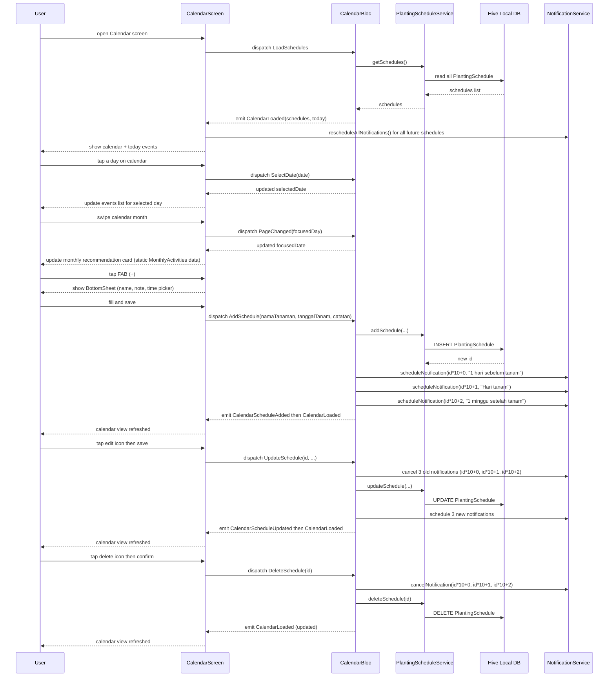
```mermaid
sequenceDiagram
    participant U as User
    participant CS2 as CalendarScreen
    participant CB2 as CalendarBloc
    participant PlantSvc as PlantingScheduleService
    participant Hive as Hive Local DB
    participant NS as NotificationService

    U->>CS2: open Calendar screen
    CS2->>CB2: dispatch LoadSchedules
    CB2->>PlantSvc: getSchedules()
    PlantSvc->>Hive: read all PlantingSchedule
    Hive-->>PlantSvc: schedules list
    PlantSvc-->>CB2: schedules
    CB2-->>CS2: emit CalendarLoaded(schedules, today)
    CS2->>NS: rescheduleAllNotifications() for all future schedules
    CS2-->>U: show calendar + today events

    U->>CS2: tap a day on calendar
    CS2->>CB2: dispatch SelectDate(date)
    CB2-->>CS2: updated selectedDate
    CS2-->>U: update events list for selected day

    U->>CS2: swipe calendar month
    CS2->>CB2: dispatch PageChanged(focusedDay)
    CB2-->>CS2: updated focusedDate
    CS2-->>U: update monthly recommendation card (static MonthlyActivities data)

    U->>CS2: tap FAB (+)
    CS2-->>U: show BottomSheet (name, note, time picker)
    U->>CS2: fill and save
    CS2->>CB2: dispatch AddSchedule(namaTanaman, tanggalTanam, catatan)
    CB2->>PlantSvc: addSchedule(...)
    PlantSvc->>Hive: INSERT PlantingSchedule
    Hive-->>PlantSvc: new id
    CB2->>NS: scheduleNotification(id*10+0, "1 hari sebelum tanam")
    CB2->>NS: scheduleNotification(id*10+1, "Hari tanam")
    CB2->>NS: scheduleNotification(id*10+2, "1 minggu setelah tanam")
    CB2-->>CS2: emit CalendarScheduleAdded then CalendarLoaded
    CS2-->>U: calendar view refreshed

    U->>CS2: tap edit icon then save
    CS2->>CB2: dispatch UpdateSchedule(id, ...)
    CB2->>NS: cancel 3 old notifications (id*10+0, id*10+1, id*10+2)
    CB2->>PlantSvc: updateSchedule(...)
    PlantSvc->>Hive: UPDATE PlantingSchedule
    CB2->>NS: schedule 3 new notifications
    CB2-->>CS2: emit CalendarScheduleUpdated then CalendarLoaded
    CS2-->>U: calendar view refreshed

    U->>CS2: tap delete icon then confirm
    CS2->>CB2: dispatch DeleteSchedule(id)
    CB2->>NS: cancelNotification(id*10+0, id*10+1, id*10+2)
    CB2->>PlantSvc: deleteSchedule(id)
    PlantSvc->>Hive: DELETE PlantingSchedule
    CB2-->>CS2: emit CalendarLoaded (updated)
    CS2-->>U: calendar view refreshed
```

---

## 14. Settings & Profile

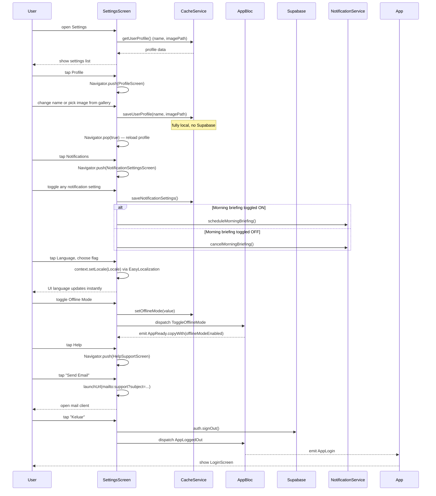
```mermaid
sequenceDiagram
    participant U as User
    participant SS as SettingsScreen
    participant CS as CacheService
    participant AB as AppBloc
    participant SB as Supabase
    participant NS as NotificationService

    U->>SS: open Settings
    SS->>CS: getUserProfile() (name, imagePath)
    CS-->>SS: profile data
    SS-->>U: show settings list

    U->>SS: tap Profile
    SS->>SS: Navigator.push(ProfileScreen)
    U->>SS: change name or pick image from gallery
    SS->>CS: saveUserProfile(name, imagePath)
    Note over CS: fully local, no Supabase
    SS->>SS: Navigator.pop(true) — reload profile

    U->>SS: tap Notifications
    SS->>SS: Navigator.push(NotificationSettingsScreen)
    U->>SS: toggle any notification setting
    SS->>CS: saveNotificationSettings()
    alt Morning briefing toggled ON
        SS->>NS: scheduleMorningBriefing()
    else Morning briefing toggled OFF
        SS->>NS: cancelMorningBriefing()
    end

    U->>SS: tap Language, choose flag
    SS->>SS: context.setLocale(Locale) via EasyLocalization
    SS-->>U: UI language updates instantly

    U->>SS: toggle Offline Mode
    SS->>CS: setOfflineMode(value)
    SS->>AB: dispatch ToggleOfflineMode
    AB-->>SS: emit AppReady.copyWith(offlineModeEnabled)

    U->>SS: tap Help
    SS->>SS: Navigator.push(HelpSupportScreen)
    U->>SS: tap "Send Email"
    SS->>SS: launchUrl(mailto:support?subject=...)
    SS-->>U: open mail client

    U->>SS: tap "Keluar"
    SS->>SB: auth.signOut()
    SS->>AB: dispatch AppLoggedOut
    AB-->>App: emit AppLogin
    App-->>U: show LoginScreen
```
